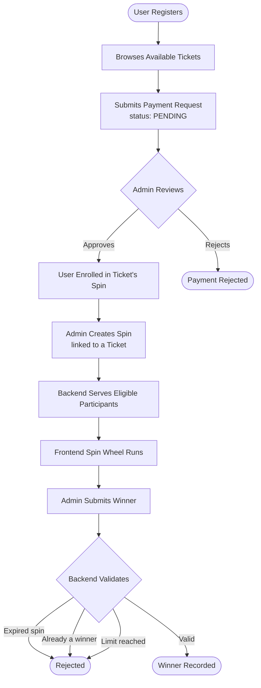

# 🎟️ Ticket Selling & Spin Rewards Platform

A NestJS REST API that manages a ticket sales lifecycle with spin-based reward draws. Users purchase tickets, admins verify payments manually, and winners are selected through a spin wheel with full business rule enforcement on the backend.

---

## 🧠 Business Logic

---

## ⚡ Challenges & Solutions

**RBAC with NestJS & JWT** — Layering authentication and role-based access cleanly in NestJS required understanding its guard and decorator system. Solved by implementing a custom `@Roles()` decorator with a `RolesGuard` that reads the role from the JWT payload, keeping authorization declarative and controllers clean.

**Spin validation logic** — Adding a winner required enforcing multiple rules at once: spin expiry, duplicate winners, and winner limits. Solved with sequential validation checks in strict order, each returning a specific error, with the `used` counter only incrementing after all checks pass.

**Manual payment flow** — Without a payment gateway, payments needed a clear state machine. Only admins can transition a payment from `PENDING` to `APPROVED` or `REJECTED`, and each payment has a unique `transactionId` to correlate with out-of-band confirmation.

---

## 🚀 Features

- Role-Based Access Control — `User`, `Admin`, `Super Admin` with custom guards and decorators
- Auto-seeded Super Admin on application bootstrap
- Manual payment lifecycle — Pending → Approved / Rejected
- Spin reward system with expiry enforcement, winner limits, and duplicate prevention
- National ID encryption at rest via Mongoose schema hooks
- Payment analytics and most-sold ticket tracking for admins
- Ticket management with quantity tracking, expiry, and sold-count

---

## 🗂️ Entity Relationship Diagram

---

## 🧰 Tech Stack

| Layer | Technology | Purpose |
|---|---|---|
| Framework | NestJS | Modular, scalable server-side architecture |
| Database | MongoDB + Mongoose | Flexible document modeling with schema validation |
| Authentication | JWT | Stateless auth tokens |
| Authorization | Custom Guards + Decorators | Declarative RBAC across all routes |
| Password Security | bcrypt | Salted password hashing |
| Language | TypeScript | End-to-end type safety |
